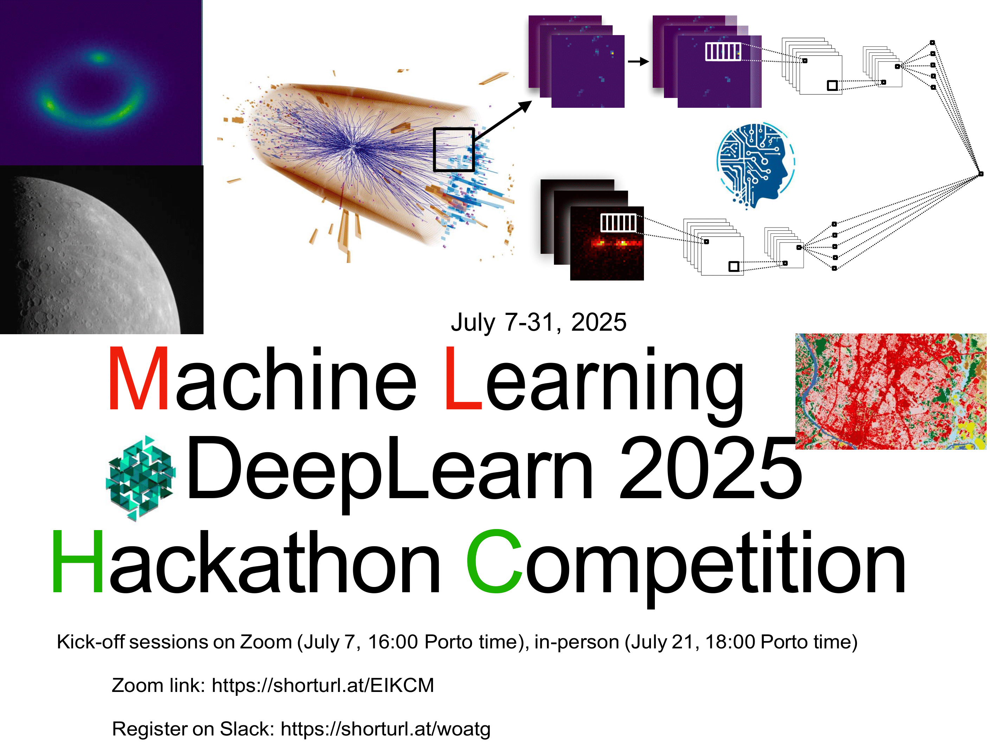

We are pleased to announce the **DeepLearn 2025 Hackathon Competition** that will take place from **July 7-31, 2025** in a hybrid format. The competition is open to all DeepLearn participants. The hackathon will focus on applying **machine learning** techniques to a variety of realistic challenges, including those from the fields of science and humanities. 

<!-- Please find the competition poster at [this link](https://bit.ly/4eLoTu6) -->

<!-- The agenda for the hackathon can be found here: [https://indico.cern.ch/event/1432069/](https://indico.cern.ch/event/1432069/) -->

Anyone interested in learning more about machine learning techniques and trying their hand at the competition is welcome. Participants are encouraged to self-organize into small teams or work on their own to devise unique solutions to the challenge(s). The participants can work on the challenges on their own schedule. The competition will run for three weeks, however only a small fraction of that time is needed to obtain competitive results. Participants will have opportunities to interact with the organizers and with each other in person, via Zoom and on Slack. The **virtual kickoff meeting** will be on **Monday, July 7 (17:00 CET)** on [Zoom](https://ua-edu.zoom.us/j/83389981726?pwd=YUfkyzuqXhI1gq5YydKd8wSEqDO0kN.1). The in-person meeting will be on **Monday, July 21st (18:00 CET)**. Please see the Hackathon Slack page for meeting details and additional information. Winners will receive certificates and prizes.

 Interested participants can register via Slack at [here](https://join.slack.com/t/deeplearn2025/shared_invite/zt-37ui86edf-9mE3_Myw231FdaS5UlGyDw).   
 [Pre-Hackathon survey](https://universityofalabama.az1.qualtrics.com/jfe/form/SV_8bJJW9ehpwxjyZ0).

There are seven main challenges:
* Higgs Boson Challenge (Classification, General)
* Particle Images Challenge (Classification, Computer Vision)
* Strong Lensing Challenge (Multi-class Classification, Superresolution, Computer Vision)
* RenAIssance Challenge (NLP, transcription)
* NMR Spin Challenge (Multi-Target Regression)
* Exoplanet Search (Classification, Image Analysis)
* Quantum Machine Learning (Anomaly Detection, Quantum Computing)

Please find more details and example Jupyter notebooks inside each challenge folder. 

Solutions are due on Monday, July 28 at 18:00 CET. Winners will receive certificates and prizes.
